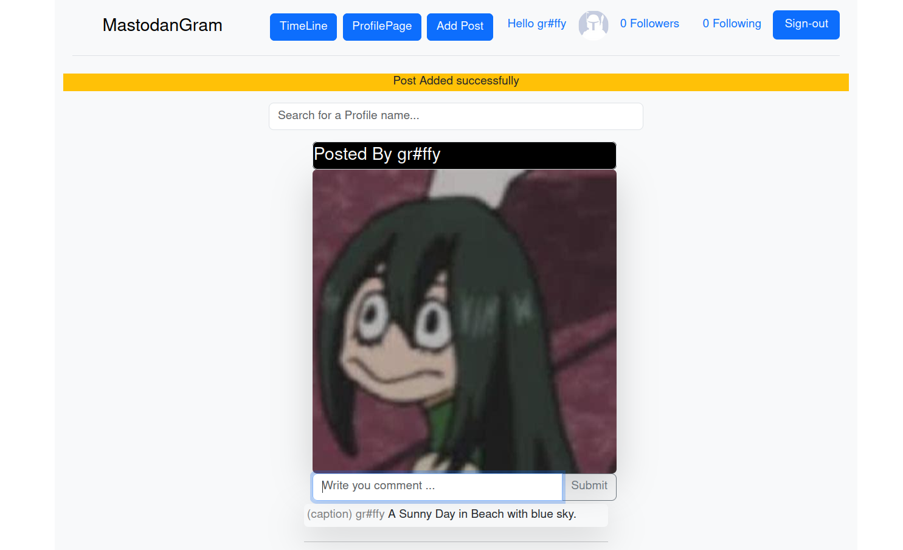

# About
  A simplified replica of Instagram.
.Nosql used for this application is Google Cloud Platform datastore and bucket
  
# How To run
 To run the server you first need to create Google Cloud Platform account and save your identification    
into enviornment variable of your shell and install packages listed in requirements.txt and finally run the server:  
    
```    
python main.py
```  
    
# Sample Front Page     


